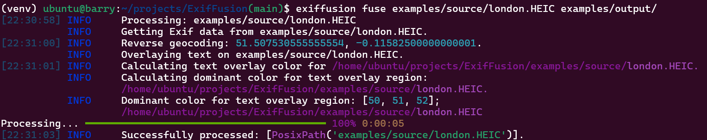
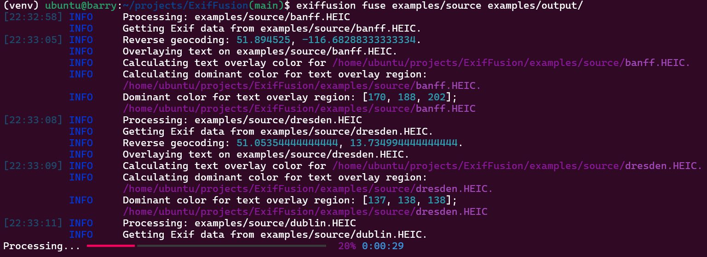

# ExifFusion

Augment physical photo albums by overlaying useful Exif metadata onto the photos.

Add datetime and location to photos.

Only tested on iPhone photos in HEIC format.

## Key Features

- Extract Exif metadata from photos.
- Overlay metadata onto photos, such as datetime and location.
- Reverse geo-code GPS cordinates into addresses.
- Dynamically chooses black or white text color to maximize contrast. Based on the dominant background color in the text area.
- [TODO] QR Code for more information, link to map

## Installation
```bash
pip install exiffusion
```


## Usage

Use on a single image:
```bash
exiffusion fuse INPUT_IMAGE_PATH OUTPUT_DIRECTORY_PATH
```



Or use on a directory of images:
```bash
exiffusion fuse INPUT_DIRECTORY_PATH OUTPUT_DIRECTORY_PATH
```



For help:
```bash
exiffusion --help
exiffusion fuse --help
```

## Example

### Swakopmund
```bash
exiffusion fuse examples/source/Swakopmund.HEIC examples/output
```


### Gdansk
```bash
exiffusion fuse examples/source/gdansk.HEIC examples/output
```


### Odesa
```bash
exiffusion fuse examples/source/odesa.HEIC examples/output
```


## TODO

- Summary report on success and failure at the end
- qr code
- Investigate london color-contrast

## Development
```bash
pip install -e .
```

## License

See [License](LICENSE).
